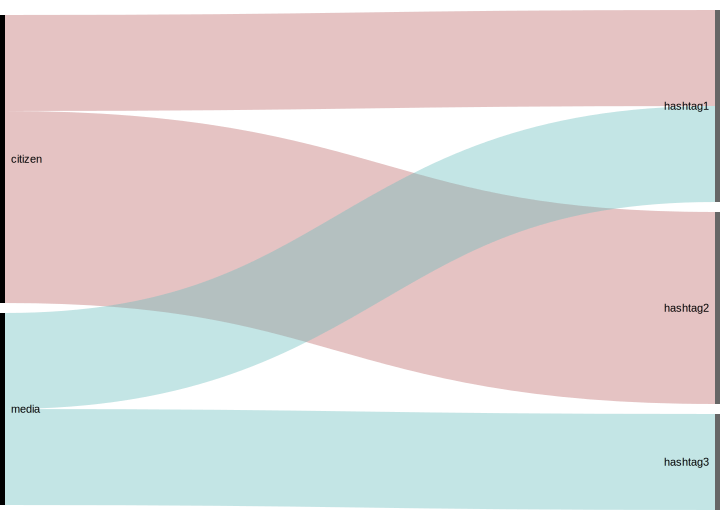

# narrowifyObservations
Reshape "key, value1; value2" lines to "key, value1", "key, value2" lines

The particular usecase for this was to reshape

    citizen, hashtag1; hashtag2
    citizen, hashtag2
    media, hashtag1; hashtag3

to

    citizen, hashtag1
    citizen, hashtag2
    citizen, hashtag2
    media, hashtag1
    media, hashtag3

For use with [RAWGraphs.io](http://app.rawgraphs.io/), particulary alluvial graphs.

